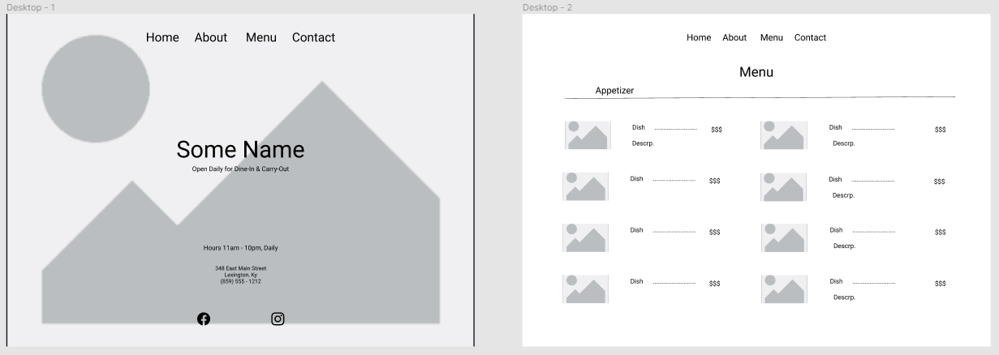

# **React-Restaurant Website

### **Wireframe**:
 

  

## **Goal**: Create a fictitious restaurant website using React and dynamically pull menu items from an API.
  
## **Items to remember**:
  - Need restaurant name, address, and hours of operation displayed.
  -	Access API with Axios only.
  -	Display menu in sections
  -	Appetizers
  -	Lunch
  -	Dinner
  -	Etc.
  -	Each menu item must have its own organism
  -	Manage React Component State
  -	Must be responsive design
   
## **Stretch Goals | Nice to have**:
  -	Modify Title and meta tags
  -	Embed Google map component showing location
  -	Include ‘Specials Menu’ for day of the week
  -	Use React-Context
  -	Parse results of the API to show a list of sides for substitutions

  

## **Main App Page**:

  - Render navbar centered top of page
    - Home link should not re-route while on main page
    - About link should route to about restaurant page
    - Menu link should route to menu page
    - Contact should route to contact page
  - Render restaurant title center horizontally & vertically on page
    - Render sub-title in smaller text centered below title
  - Render hours and days of operation centered horizontally three quarters down the page
    - Include address and phone number in slightly smaller text
  - Render social links in footer

  

## **Menu Page**:

  - Render navbar centered top of page
    - Home link should route back to main page
    - About link should route to about restaurant page
    - Menu link should not re-route while on menu page
    - Contact should route to contact page
  - Render restaurant title center horizontally & vertically on page
    - Render sub-title in smaller text centered below title
  - Render hours and days of operation centered horizontally three quarters down the page
    - Include address and phone number in slightly smaller text
  - Render social links in footer

  

## **About Page**: (Nice to have)

## **Contact Page**: (Nice to have)

  

## **Functions**:

  - Retrieve data from API using Axios
    - Make sure to import axios
    - Use async / await
    - Possibly store in a utilities folder

  - Create API storage for data
    - Setup local storage function
